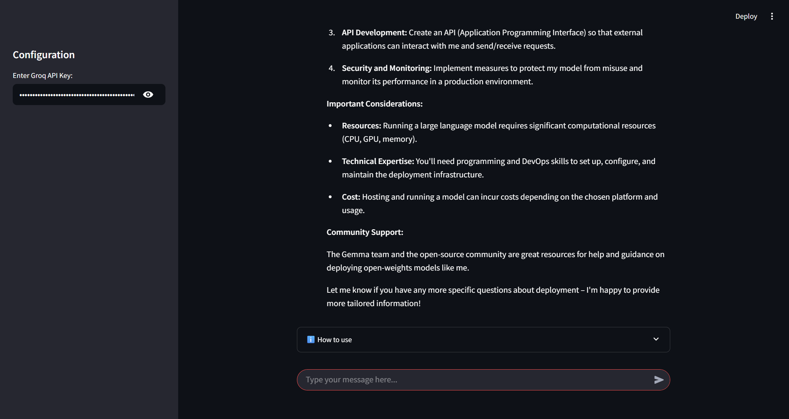

# 🤖 AI Chatbot with LangChain & Groq

A production-ready chatbot built with LangChain, Groq AI, and multiple deployment options. This chatbot features conversational memory, message history management, and can be deployed as both a Streamlit web app and Flask API.



## ✨ Features

- 🧠 **Conversational Memory** - Remembers conversation history across sessions
- 🔧 **Multiple Deployment Options** - Streamlit web app, Flask API, and HTML interface
- 🚀 **Easy Deployment** - Ready for Render, Railway, Streamlit Cloud, and more
- 🔒 **Secure API Key Management** - Environment variable support
- 📱 **Responsive UI** - Works on desktop and mobile devices
- 🎯 **Token Management** - Automatic conversation trimming to stay within limits
- 🌍 **Multi-language Support** - Responds in different languages

## 🎯 Demo

### Streamlit Web Interface


### Configuration Panel


## 📁 Project Structure

```
ai-chatbot/
├── 📊 1-chatbots.ipynb              # Main development notebook
├── 🌐 streamlit_chatbot.py          # Streamlit web application
├── 🔧 flask_chatbot.py              # Flask API server
├── 🎨 chatbot_interface.html        # HTML interface for Flask API
├── 📋 requirements.txt              # Python dependencies
├── 📋 requirements-production.txt   # Production-optimized dependencies
├── 🔍 verify_deployment.py          # Deployment verification script
├── 🔐 setup_env_template.py         # Environment setup helper
├── 🚫 .gitignore                    # Git ignore file
├── 🔒 API_SECURITY_GUIDE.md         # API security best practices
├── 📖 README.md                     # This file
└── 📁 assets/                       # Documentation images
    ├── chatbot-demo.png
    ├── streamlit-demo.png
    └── config-panel.png
```

## 🚀 Quick Start

### Prerequisites

- Python 3.8 or higher
- Groq API key ([Get it here](https://console.groq.com/keys))

### Installation

1. **Clone the repository**
   ```bash
   git clone https://github.com/yourusername/ai-chatbot.git
   cd ai-chatbot
   ```

2. **Install dependencies**
   ```bash
   pip install -r requirements.txt
   ```

3. **Set up your API key**
   
   **Option A: Environment Variable (Recommended)**
   ```bash
   # Create .env file
   echo "GROQ_API_KEY=your_actual_api_key_here" > .env
   ```
   
   **Option B: Use Setup Helper**
   ```bash
   python setup_env_template.py
   ```

4. **Verify installation**
   ```bash
   python verify_deployment.py
   ```

### Running the Application

#### 🌐 Streamlit Web App (Recommended)
```bash
streamlit run streamlit_chatbot.py
```
Open your browser to `http://localhost:8501`

#### 🔧 Flask API
```bash
python flask_chatbot.py
```
API available at `http://localhost:5000`

#### 🎨 HTML Interface
1. Start the Flask API (above)
2. Open `chatbot_interface.html` in your browser

## 🛠️ Configuration

### Environment Variables

| Variable | Description | Required |
|----------|-------------|----------|
| `GROQ_API_KEY` | Your Groq API key | ✅ Yes |
| `PORT` | Server port (for deployment) | ❌ No |

### Model Configuration

The chatbot uses the `Gemma2-9b-It` model by default. You can modify this in the code:

```python
model = ChatGroq(model="Gemma2-9b-It", groq_api_key=groq_api_key)
```

## 🌐 Deployment

### Streamlit Cloud (Free & Easy)

[](https://share.streamlit.io)

1. Fork this repository
2. Go to [share.streamlit.io](https://share.streamlit.io)
3. Connect your GitHub account
4. Deploy `streamlit_chatbot.py`
5. Add `GROQ_API_KEY` in Streamlit secrets

### Render (Free Tier)

[](https://render.com)

1. Fork this repository
2. Create account at [render.com](https://render.com)
3. Create new Web Service from GitHub
4. Configure:
   - **Build Command**: `pip install -r requirements.txt`
   - **Start Command**: `streamlit run streamlit_chatbot.py --server.port=$PORT --server.address=0.0.0.0`
   - **Environment Variable**: `GROQ_API_KEY=your_key_here`

### Railway (Free Tier)

[](https://railway.app)

1. Fork this repository
2. Go to [railway.app](https://railway.app)
3. Create new project from GitHub
4. Add environment variable: `GROQ_API_KEY`
5. Deploy automatically

### Docker Deployment

```dockerfile
FROM python:3.9-slim

WORKDIR /app
COPY requirements.txt .
RUN pip install -r requirements.txt

COPY . .

EXPOSE 8501

CMD ["streamlit", "run", "streamlit_chatbot.py", "--server.port=8501", "--server.address=0.0.0.0"]
```

## 🔧 API Reference

### Flask API Endpoints

#### POST /chat
Send a message to the chatbot.

**Request:**
```json
{
  "message": "Hello, how are you?",
  "api_key": "your_groq_api_key",
  "session_id": "user_session_123"
}
```

**Response:**
```json
{
  "response": "Hello! I'm doing well, thank you for asking. How can I help you today?",
  "session_id": "user_session_123"
}
```

#### GET /health
Check API health status.

**Response:**
```json
{
  "status": "healthy",
  "model_initialized": true
}
```

## 🧪 Development

### Running Tests
```bash
python verify_deployment.py
```

### Code Structure

The project follows these key patterns:

- **Separation of Concerns**: Web interface, API, and core logic are separated
- **Environment-based Configuration**: Uses environment variables for secrets
- **Memory Management**: Implements conversation trimming to prevent token overflow
- **Error Handling**: Comprehensive error handling and user feedback

### Key Components

1. **Message History Management**
   ```python
   from langchain_community.chat_message_histories import ChatMessageHistory
   from langchain_core.runnables.history import RunnableWithMessageHistory
   ```

2. **Conversation Trimming**
   ```python
   from langchain_core.messages import trim_messages
   trimmer = trim_messages(max_tokens=45, strategy="last")
   ```

3. **Session Management**
   ```python
   def get_session_history(session_id: str) -> BaseChatMessageHistory:
       if session_id not in store:
           store[session_id] = ChatMessageHistory()
       return store[session_id]
   ```

## 🔒 Security

### Best Practices Implemented

- ✅ **No hardcoded API keys** in version control
- ✅ **Environment variable** configuration
- ✅ **Input validation** on all endpoints
- ✅ **Error handling** without exposing internals
- ✅ **CORS configuration** for web security

### Security Checklist

Before deploying:
- [ ] API keys stored as environment variables
- [ ] `.env` file in `.gitignore`
- [ ] No sensitive data in code
- [ ] HTTPS enabled (automatic on most platforms)

## 🤝 Contributing

We welcome contributions! Please see our [Contributing Guidelines](CONTRIBUTING.md).

### Development Setup

1. Fork the repository
2. Create a feature branch: `git checkout -b feature-name`
3. Make your changes
4. Run tests: `python verify_deployment.py`
5. Commit changes: `git commit -am 'Add feature'`
6. Push to branch: `git push origin feature-name`
7. Submit a Pull Request

## 📝 License

This project is licensed under the MIT License - see the [LICENSE](LICENSE) file for details.

## 🆘 Support

### Getting Help

- 📖 **Documentation**: Check this README and [API Security Guide](API_SECURITY_GUIDE.md)
- 🐛 **Issues**: [Create an issue](https://github.com/yourusername/ai-chatbot/issues)
- 💬 **Discussions**: [GitHub Discussions](https://github.com/yourusername/ai-chatbot/discussions)

### Common Issues

<details>
<summary>API Key Issues</summary>

**Problem**: "API key is required" error

**Solutions**:
- Ensure your API key is set in environment variables
- Check the API key is valid at [Groq Console](https://console.groq.com/keys)
- Verify no extra spaces in the API key
</details>

<details>
<summary>Deployment Issues</summary>

**Problem**: App fails to start on hosting platform

**Solutions**:
- Check build logs for specific errors
- Ensure `requirements.txt` is up to date
- Verify start command uses `$PORT` environment variable
- Run `python verify_deployment.py` locally first
</details>

<details>
<summary>Memory Issues</summary>

**Problem**: Conversation becomes incoherent over time

**Solutions**:
- The app automatically trims old messages
- Adjust `max_tokens` in the trimmer configuration
- Consider implementing conversation reset functionality
</details>

## 🌟 Features Roadmap

### Planned Features

- [ ] **Authentication System** - User accounts and session management
- [ ] **Conversation Export** - Download chat history as PDF/JSON
- [ ] **Custom Models** - Support for other LLM providers
- [ ] **Voice Interface** - Speech-to-text and text-to-speech
- [ ] **File Upload** - Chat about documents and images
- [ ] **Conversation Templates** - Pre-defined conversation starters
- [ ] **Analytics Dashboard** - Usage statistics and insights
- [ ] **Multi-user Support** - Team collaboration features

### Version History

- **v1.0.0** - Initial release with basic chatbot functionality
- **v1.1.0** - Added Flask API and HTML interface
- **v1.2.0** - Enhanced security and deployment options
- **v1.3.0** - Added conversation memory management

## 🏆 Acknowledgments

- [LangChain](https://langchain.com/) for the amazing framework
- [Groq](https://groq.com/) for fast LLM inference
- [Streamlit](https://streamlit.io/) for the easy-to-use web framework
- [Gemma](https://ai.google.dev/gemma) for the language model

## 📊 Stats


---

**Made with ❤️ by [Your Name](https://github.com/yourusername)**

*If you find this project helpful, please give it a ⭐ star!*
